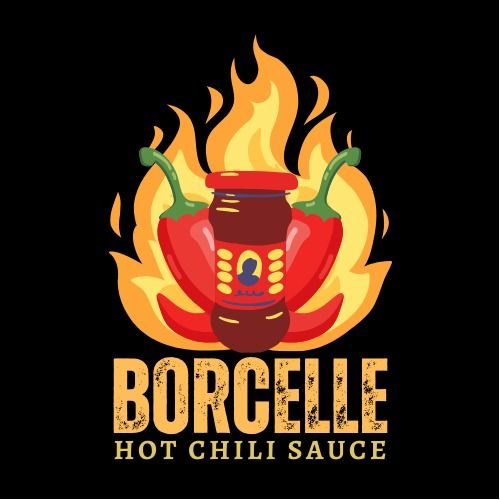

# 🍽️ مطعم طعام المحبين | وليد البغدادي

## 🔗 الروابط
- 🌐 **الموقع الحي:** [https://baraaelh.github.io/restaurant-project](https://baraaelh.github.io/restaurant-project)
- 💾 **مستودع الكود:** [https://github.com/Baraaelh/restaurant-project](https://github.com/Baraaelh/restaurant-project)

## 👨‍💻 عن المطور
**وليد البغدادي** - مطور واجهات أمامية متخصص

📧 **البريد الإلكتروني:** braalhdad701@gmail.com  
🐱 **GitHub:** [Baraaelh](https://github.com/Baraaelh)

## 🚀 ميزات المشروع
✅ تصميم متجاوب يعمل على جميع الأجهزة  
✅ واجهة مستخدم حديثة وجذابة  
✅ قائمة طعام تفاعلية  
✅ معرض صور متحرك  
✅ نموذج اتصال يعمل  
✅ SEO محسن  
✅ أداء سريع  

## 🛠 التقنيات المستخدمة
- HTML5
- CSS3 (Flexbox, Grid, Animations)
- JavaScript (ES6+)
- Git & GitHub
- GitHub Pages

## 📁 هيكل المشروع
restaurant-project/
├── index.html # الصفحة الرئيسية
├── css/ # أنماط التصميم
├── js/ # ملفات الجافاسكريبت
├── img/ # الصور والوسائط
├── README.md # وثائق المشروع
└── ... # ملفات إضافية

## 📞 معلومات المطعم (توضيحية)
- **الاسم:** مطعم طعام المحبين
- **المالك:** وليد البغدادي
- **العنوان:** الرياض، السعودية
- **الهاتف:** +966 50 123 4567
- **البريد:** info@restaurant.com

## 📊 إحصائيات
- **تاريخ الإنجاز:** يناير 2025
- **وقت التطوير:** 40+ ساعة
- **أسطر الكود:** 2000+ سطر
- **الحالة:** ✅ مكتمل وجاهز

## 🤝 المساهمة
1. Fork المشروع
2. أنشئ فرعاً جديداً
3. أضف تعديلاتك
4. افتح Pull Request

## 📄 الرخصة
هذا المشروع مرخص تحت رخصة MIT - انظر ملف LICENSE للتفاصيل.

---
⭐ **إذا أعجبك المشروع، لا تنسى إعطاء نجمة على GitHub!**

🎉 أكملت مشروع مطعم تفاعلي!

تقنيات: HTML5, CSS3, JavaScript
رابط: https://baraaelh.github.io/restaurant-project
كود: https://github.com/Baraaelh/restaurant-project

#WebDevelopment #Frontend #Portfolio #HTML #CSS #JavaScript
